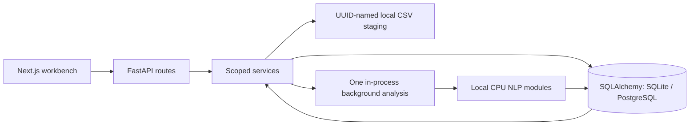

# Implementation architecture

Current local batch architecture; verification evidence is in `docs/CODEX_AUDIT.md`.

Routes validate Pydantic inputs and delegate workflow/analytics to services. The frontend's typed fetch wrapper mirrors response envelopes; shared context follows dataset/run URL parameters. Dataset pages use the dataset route ID and do not race URL canonicalization against upload navigation. Read requests clear stale results when their complete resource identity changes and visibly expose failures/retry.

CSV staging connects upload, raw preview, mapping, validation and import without reuploading. Stored filenames are generated from dataset UUIDs; original client filenames are display metadata. Validation reparses the staged file. Import revalidates and atomically inserts normalized posts plus the imported state. A successful repeated import is idempotent. Imported sources and preprocessing are immutable. Failed imports roll back; missing legacy staging requires uploading the original file again as a new dataset. Deletion blocks active jobs, removes tracked artifacts and cascades results. SQLite foreign keys are enabled on connections.

An enqueue lock serializes readiness checks and creation within the single backend process. A global pending/running row guard rejects concurrent work with 409. The worker persists progress checkpoints and terminal status. Core inference failures roll back the current transaction before recording failure; optional absent NER completes with explicit warnings. Process startup marks old active runs interrupted/failed. Partial failed-run rows can remain for debugging but completed-run analytics reject them. This is intentionally not a multi-worker/durable distributed queue.

Canonical dataset text representations are reused by subsequent analyses. Each run owns sentiment, topics/assignments, entities/links, keywords and daily trend snapshots. Every analytics join includes the selected run and dataset where relevant. Search supports raw dataset browsing without a run; sentiment/topic filters require a completed run. No global latest-run resolution is used. Topic detail aggregates the complete selected assignment set and separately samples the ten strongest representative posts.

The same TrendEngine computes stored daily snapshots and read-side hourly/weekly/platform views. Changed selectors recompute meaningful buckets and rankings rather than relabeling daily data. Calendar gaps and elapsed topic inactivity are explicit zero buckets through the dataset reference timestamp. At most 20,000 buckets are permitted; narrower windows across very long data ranges produce a recovery error.

The frontend uses semantic HTML, native forms/dialogs and small React components. SVG activity charts support focus/hover details and an exact data table; no chart-library dependency is needed. Locally bundled fonts avoid build-time Google Fonts requests. Plain Ledger component CSS coexists with Tailwind's baseline styles. There is no streaming integration, auth, paid service, remote LLM or external queue.

Local privacy boundary: uploaded posts and artifacts remain in the configured DB/upload directory, while first-time model downloads contact official registries. Bind to loopback and use trusted local files; this project is not an internet-facing multi-user service. Keep those local directories out of Git and back them up together when retaining datasets.
