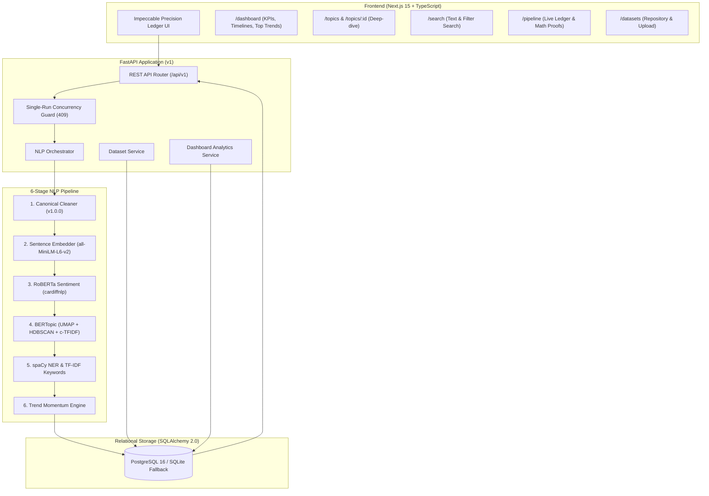

# Social Trend Analyzer

> **An NLP-Powered Platform for Detecting Emerging Topics, Sentiment Polarization, and Temporal Momentum from Social Media Text**

[](https://www.python.org/)
[](https://fastapi.tiangolo.com/)
[](https://nextjs.org/)
[](LICENSE)
[]()
[]()

---

## 1. Project Overview

**Social Trend Analyzer** is a full-stack Natural Language Processing (NLP) system designed to ingest social media datasets and automatically discover emerging topics, trending keywords/hashtags, sentiment dynamics, named entities, and temporal momentum.

All insights are calculated locally on CPU using state-of-the-art transformer and statistical models, and surfaced through a high-precision, interactive analytics dashboard.

---

## 2. Implementation Status: Phase 1 through Phase 12 Complete

The application has been completed through all phases defined in the implementation specification:

- [x] **Phase 1: Project Foundation** — FastAPI backend, Next.js 15 App Router frontend, SQLAlchemy 2.0 dialect-aware models, Alembic migrations, Docker Compose PostgreSQL.
- [x] **Phase 2: Dataset Ingestion** — Resilient CSV parser, auto-column mapping, schema validation, normalization, and 850-post multi-platform synthetic demo generator.
- [x] **Phase 3: NLP Preprocessing** — Canonical, immutable `v1.0.0` text representations (`original_text`, `cleaned_text`, `sentiment_ready_text`, runtime case-preserved text for NER), deduplication hash tracking.
- [x] **Phase 4: Sentiment Analysis** — CardiffNLP Twitter-RoBERTa 3-class classifier with batched CPU inference, continuous polarity $[-1, 1]$, and single-run concurrency guard (HTTP 409 Conflict).
- [x] **Phase 5: Topic Modeling** — Sentence Transformers `all-MiniLM-L6-v2` dense embeddings, BERTopic with UMAP (seed 42), HDBSCAN (`nr_topics=None`), and c-TF-IDF keyword extraction.
- [x] **Phase 6: NLP Enrichment** — spaCy `en_core_web_sm` Named Entity Recognition on case-preserved text, sublinear TF-IDF keyword extraction, and hashtag velocity tracking.
- [x] **Phase 7: Trend Detection Engine** — Multi-factor momentum modeling, centered logistic normalization ($S(0)=0.50$), exponential recency decay $R=e^{-\lambda \Delta t}$, burstiness $z$-score detection, and 5-state trend classification.
- [x] **Phase 8: Analytics APIs** — High-performance REST endpoints (`/dashboard/summary`, `/dashboard/timeline`, `/posts/search`, `/pipeline/metadata`).
- [x] **Phase 9: Analytics Dashboard** — Impeccable precision ledger UI (`/dashboard`) featuring KPI cards, timeline graphs, trending topics table with TrendScore meter, entity/hashtag panels, and 1-click synthetic demo generator.
- [x] **Phase 10: Trend Investigation & Search** — `/topics` explorer, `/topics/[id]` deep-dive with trajectory history & representative post feed, `/search` with full-text search & sentiment/platform filters, and `/datasets` repository.
- [x] **Phase 11: Evaluation & Testing** — Live `/pipeline` model ledger & mathematical formulation inspector, 80 passing automated unit/integration tests with **87% code coverage**.
- [x] **Phase 12: Documentation & Academic Polish** — Model evaluation benchmarks, academic report notes, and comprehensive master documentation.

---

## 3. System Architecture



---

## 4. Key Mathematical Formulations

### 4.1 Base Momentum ($M_{\text{base}}$)
The base momentum combines volume velocity, burstiness, engagement acceleration, and sentiment polarization:

$$M_{\text{base}} = w_{\text{vol}} S(V) + w_{\text{burst}} S(B) + w_{\text{eng}} S(E) + w_{\text{sent}} S(|S|)$$

*Default Weights:* $w_{\text{vol}} = 0.35$, $w_{\text{burst}} = 0.25$, $w_{\text{eng}} = 0.25$, $w_{\text{sent}} = 0.15$.

### 4.2 Centered Logistic Normalization ($S(x)$)
Growth rates and deviations $x$ are normalized via centered logistic sigmoid:

$$S(x) = \frac{1}{1 + e^{-kx}}, \quad \text{Guaranteeing: } S(0) = 0.50 \text{ (Neutral Baseline)}$$

### 4.3 Recency Modulation ($R$)
Recency exponentially decays deviations from baseline:

$$R(\Delta t) = \exp(-\lambda \Delta t) \in (0, 1]$$
$$\text{TrendScore} = 0.50 + (M_{\text{base}} - 0.50) \times R(\Delta t)$$

*Safety Property:* Dormant topics naturally decay back to $0.50$ (stable neutral), preventing false alarms.

---

## 5. Getting Started

### 5.1 Prerequisites
- **Python:** 3.11 or 3.12 (Python 3.12 recommended; `uv` or `python -m venv`)
- **Node.js:** v18+ or v20+ (v24 supported) with `npm`
- **Docker:** Optional (SQLite is supported out-of-the-box for zero-setup local dev)

---

### 5.2 Quick Setup

#### 1. Backend Setup
```bash
cd backend

# Create virtual environment
python -m venv .venv
source .venv/bin/activate  # On Windows: .venv\Scripts\activate

# Install dependencies from locked requirements
pip install -r requirements.lock

# (Optional) Download spaCy English model if not bundled
python -m spacy download en_core_web_sm

# Apply database migrations
alembic upgrade head

# Start FastAPI development server
uvicorn app.main:app --host 0.0.0.0 --port 8000 --reload
```

#### 2. Frontend Setup
```bash
cd frontend

# Install dependencies from committed package-lock
npm install

# Start Next.js development server
npm run dev
```

Visit **http://localhost:3000** to access the dashboard.

---

## 6. API Reference

| Method | Endpoint | Description |
|---|---|---|
| `GET` | `/api/v1/health` | Service health status check |
| `POST` | `/api/v1/datasets/sample` | Ingests or returns 850-post multi-platform demo dataset |
| `POST` | `/api/v1/datasets/upload` | Upload custom CSV dataset with column mapping |
| `GET` | `/api/v1/datasets` | List all registered datasets and metadata |
| `POST` | `/api/v1/analysis/run` | Enqueue an analysis run (concurrency guard: max 1 active) |
| `GET` | `/api/v1/analysis/{run_id}/status` | Poll run status, progress stage, and timing |
| `GET` | `/api/v1/dashboard/summary` | Comprehensive KPI aggregates, sentiment, and top trends |
| `GET` | `/api/v1/dashboard/timeline` | Temporal volume, sentiment, and engagement timeline |
| `GET` | `/api/v1/topics` | List discovered topic clusters for an analysis run |
| `GET` | `/api/v1/topics/{topic_id}` | Topic detail, trajectory history, and representative posts |
| `GET` | `/api/v1/trends` | Filterable trend snapshots (emerging, rising, burst, etc.) |
| `GET` | `/api/v1/posts/search` | Search posts with full-text query, platform, and sentiment |
| `GET` | `/api/v1/pipeline/metadata` | Inspect active model versions, parameters, and weights |

---

## 7. Automated Verification Suite

Run full verification across backend and frontend:

```bash
# Backend checks
cd backend
python -m ruff check app/ tests/          # Linting (0 errors)
python -m mypy app/ --ignore-missing-imports # Type checking (67 files, 0 errors)
python -m pytest tests/ -v                 # 80 unit & integration tests passing
python -m pytest --cov=app tests/          # Code coverage (87%)

# Frontend checks
cd frontend
npm run lint                               # ESLint (0 errors, 0 warnings)
npm run build                              # Next.js 15 production build (10 routes)
```

---

## 8. Documentation Index

- [PRD.md](PRD.md) — Product requirements and user journeys.
- [ARCHITECTURE.md](ARCHITECTURE.md) — Detailed technical architecture and data flow.
- [NLP_PIPELINE.md](NLP_PIPELINE.md) — NLP pipeline architecture and stage specifications.
- [DATA_SCHEMA.md](DATA_SCHEMA.md) — Relational schema design and indexing strategy.
- [docs/MODEL_EVALUATION.md](docs/MODEL_EVALUATION.md) — Model selection benchmarks, comparison tables, and mathematical proofs.
- [docs/PROJECT_REPORT_NOTES.md](docs/PROJECT_REPORT_NOTES.md) — Complete academic report and presentation guide.

---

## 9. License

This project is licensed under the MIT License — see the [LICENSE](LICENSE) file for details.
Pretrained transformer models are subject to their respective open licenses:
- `cardiffnlp/twitter-roberta-base-sentiment-latest`: CC-BY-4.0
- `sentence-transformers/all-MiniLM-L6-v2`: Apache 2.0
- `spaCy en_core_web_sm`: MIT
